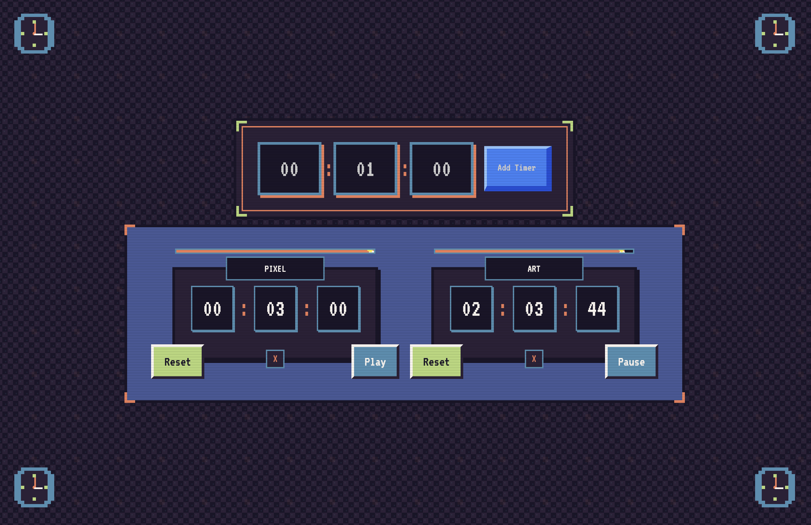

# Pixel Timer

Un timer stylisé en pixel art créé avec Next.js, permettant de gérer plusieurs compte à rebours simultanément.

## 🌐 Demo

[Voir l'application en direct](https://retro-timer.vercel.app/)

## 📷 Aperçu



## 🎮 Fonctionnalités

- ⏰ Création de multiples timers
- ✏️ Personnalisation du nom de chaque timer
- ⏯️ Contrôles Play/Pause pour chaque timer
- 🔄 Fonction Reset
- 🎨 Design pixel art
- 🌈 Animations et effets visuels
- 🔔 Alerte sonore à la fin du décompte

## 🛠️ Technologies Utilisées

- Next.js 13/14
- Tailwind CSS
- Zustand (Gestion d'état)

## 🚀 Installation

```bash
# Cloner le repository
git clone https://github.com/votre-username/pixel-timer.git

# Installer les dépendances
cd pixel-timer
npm install

# Lancer le serveur de développement
npm run dev
```

## 💻 Utilisation

1. Entrez le temps souhaité (heures, minutes, secondes)
2. Cliquez sur "Créer Timer"
3. Personnalisez le nom du timer (optionnel)
4. Utilisez les boutons de contrôle pour gérer votre timer :

- Play/Pause : Démarrer ou mettre en pause le décompte
- Reset : Réinitialiser le timer
- Remove : Supprimer le timer

## 🎨 Design

Le design s'inspire de l'esthétique pixel art avec :

- Une palette de couleurs rétro
- Des bordures et effets pixelisés
- Des animations inspirées des jeux rétro
- Une barre de progression stylisée

## 🤝 Contribution

Les contributions sont les bienvenues ! N'hésitez pas à :

- Forker le projet
- Créer une branche (`git checkout -b feature/amazing-feature`)
- Commiter vos changements (`git commit -m 'Add amazing feature'`)
- Pusher sur la branche (`git push origin feature/amazing-feature`)
- Ouvrir une Pull Request
